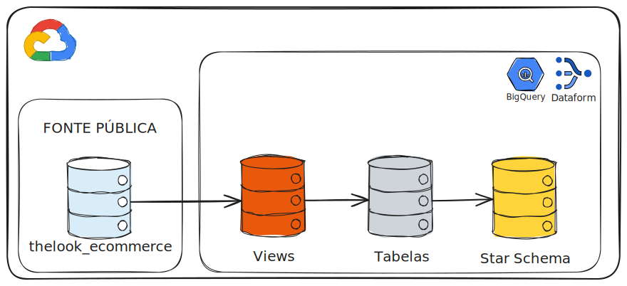

# Dataform DW Pipeline

Pipeline automatizado de Engenharia de Dados para transformação e modelagem analítica de dados de e-commerce em Data Warehouse.

## Overview
Este projeto implementa um workflow de dados completo seguindo a **arquitetura medalhão** (Bronze/Silver/Gold), utilizando **Dataform** para orquestração e versionamento das transformações SQL, e **BigQuery** como Data Warehouse. O objetivo é consumir dados públicos de e-commerce (`bigquery-public-data.thelook_ecommerce`), aplicar tratamentos de qualidade e disponibilizar um modelo dimensional (**Star Schema**) pronto para consumo analítico.



## Tech Stack
* **Orquestração/Transformação:** Dataform
* **Data Warehouse:** Google BigQuery
* **Linguagem:** SQL & SQLX
* **Infraestrutura:** Google Cloud Platform (GCP)
* **Controle de Versão:** Git
* **Qualidade de Dados:** Dataform Assertions (uniqueKey, nonNull)
* **Fonte de Dados:** BigQuery Public Datasets (thelook_ecommerce)

## Estrutura do Projeto
```text
.
├── definitions/            # Transformações SQL (SQLX)
│   ├── bronze/                 # Camada de ingestão (views 1:1 com a fonte)
│   ├── silver/                 # Camada de limpeza e enriquecimento
│   └── gold/                   # Camada de modelagem dimensional (Star Schema)
├── includes/               # Constantes e funções JavaScript reutilizáveis
├── workflow_settings.yaml  # Configuração do projeto Dataform
└── .df-credentials.json    # Credenciais locais (não versionado)
```

## Processo de Transformação
* **Bronze:** Views de leitura direta da fonte pública (`bigquery-public-data.thelook_ecommerce`), sem transformação, apenas seleção e renomeação de colunas.
* **Silver:** Limpeza, padronização de texto, remoção de duplicatas e nulos, filtros de qualidade e enriquecimento via joins entre entidades.
* **Gold:** Modelagem dimensional final (Star Schema) com uma tabela fato (`fct_order_items`) e duas dimensões (`dim_users`, `dim_products`), particionada e clusterizada para otimização de consultas, com testes de qualidade de dados (assertions).
