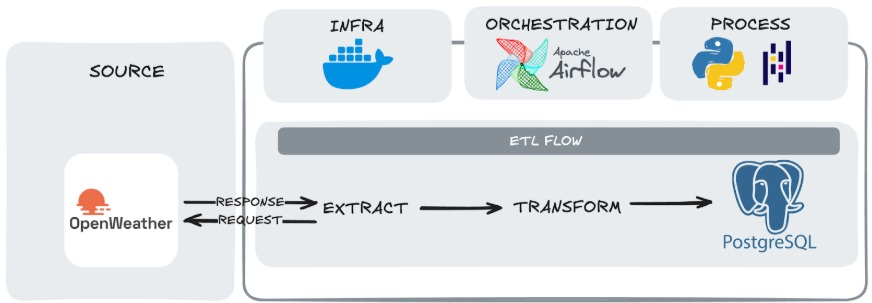
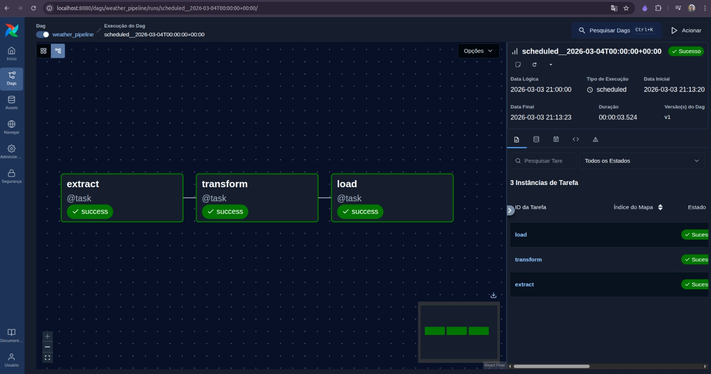
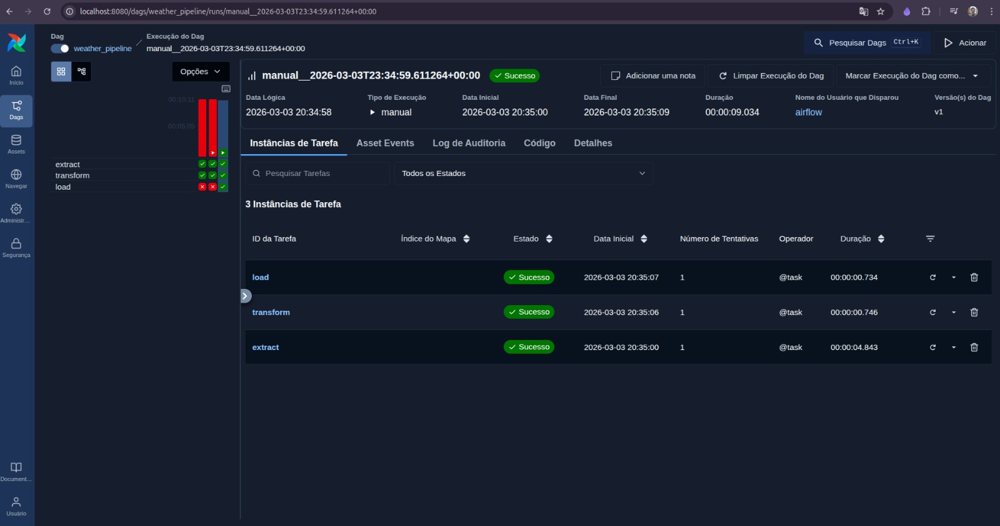
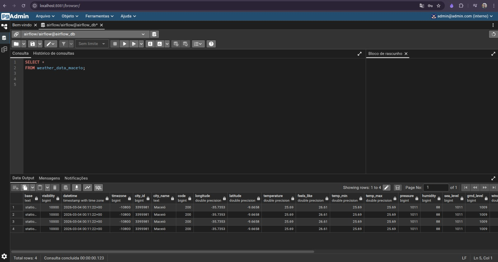

# 🌦️ ETL Weather Pipeline

Pipeline automatizado de Engenharia de Dados para extração, processamento e carga de dados climáticos em tempo real.

## 🚀 Overview
Este projeto implementa um workflow de dados completo (ETL), utilizando **Apache Airflow** para orquestração e **Docker** para isolamento de infraestrutura. O objetivo é coletar dados de temperatura e condições climáticas da cidade de Maceió via **API REST** e persistir em um **banco relacional** para análise exploratória.



## 🛠️ Tech Stack
* **Orquestração:** Apache Airflow
* **Linguagem:** Python 3.12
* **Gerenciamento de Pacotes:** `uv` (Fast Python package installer)
* **Infraestrutura:** Docker & Docker Compose
* **Banco de Dados:** PostgreSQL 16
* **Data Tools:** Pandas, SQLAlchemy, Jupyter Notebook
* **Monitoramento:** pgAdmin 4
* **Armazenamento:** JSON (Raw) e Parquet (Processed)

## 📁 Estrutura do Projeto
```text
.
├── dags/               # Definição dos Workflows (DAGs)
├── src/                # Scripts Modulares (Lógica de Negócio)
│   ├── extract_data.py    # Consumo de API REST 
│   ├── transform_data.py  # Normalização & Cleaning
│   └── load_data.py       # Persistência via SQLAlchemy
├── data/               # Camadas de dados
├── config/             # Variáveis de ambiente e airflow.cfg
└── notebooks/          # Análise exploratória e validação SQL
```

## ⚙️ Processo de ETL
* **Extraction:** Request na **API OpenWeatherMap**, logging de eventos e persistência de dados brutos em formato JSON.
* **Transformation:** Normalização de campos, conversão de dados, limpeza e tipagem de dados via Pandas.
* **Loading:** Carga incremental no **PostgreSQL** utilizando **SQLAlchemy**.



## 🚀 Como Executar

Certifique-se de possuir o Docker e Docker Compose instalados.

1. Configure as credenciais necessárias no diretório `config/`.
2. Inicie os containers:

```bash
docker compose up -d
``` 

## 🌐 Interfaces de Acesso

- **Airflow:** http://localhost:8080  



- **pgAdmin:** http://localhost:8081  


